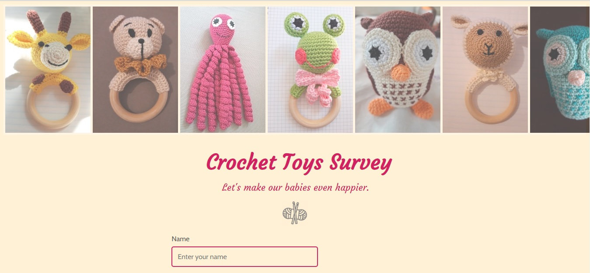
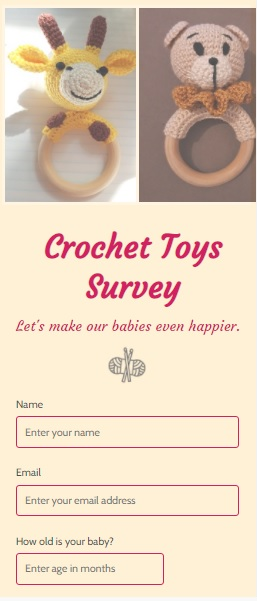

### freeCodeCamp > Responsive Web Design Projects

# Build a Survey Form

This is a solution to the freeCodeCamp's [Build a Survey Form](https://www.freecodecamp.org/learn/responsive-web-design/responsive-web-design-projects/build-a-survey-form/) project. Projects are ment to apply all of the skills, principles, and concepts learned so far: HTML, CSS, Visual Design, Accessibility, and more.

## Table of contents

- [Overview](#overview)
  - [The challenge](#the-challenge)
  - [Screenshot](#screenshot)
  - [Links](#links)
- [My process](#my-process)
  - [Built with](#built-with)
  - [What I learned](#what-i-learned)
- [Author](#author)
- [Acknowledgments](#acknowledgments)

## Overview

### The challenge
- Users complete 16 User Stories to pass the test
- Users can use HTML, JavaScript, and CSS to complete this project
- Plain CSS is recommended

### Screenshot

| Desktop layout |
|:--:|



| Mobile layout |
|:--:|


### Links

- Solution URL: https://github.com/PavlinaPs/Project2-Survey-form
- Live Site URL: https://pavlinaps.github.io/Project2-Survey-form/

## My process

### Built with

- Semantic HTML5 markup
- CSS Grid
- Flexbox

### What I learned

I learned a lot about forms.

Among other things for example this:
"The opening and closing tags for the \<textarea> element must be on the same line, otherwise a newline character occupies it. The placeholder will therefore not be displayed since the input area contains content (a newline character is, technically, valid content)." Unfortunately I don't remember where I saved this explanation from. Stack Overflow most likely.

```html
<textarea rows="5" cols="30" id="comments" name="comments" placeholder="Please leave a comment"></textarea>
```

Another useful thing I figured is how to have "Select a toy" on the first line of the dropdown menu which can't be selected:

```html
<select id="dropdown" name="dropdown">
  <option disabled="" selected="">Select a toy</option>
  <option value="octopus">Octopus</option>
  ...
```

I like the changing opacity and size on hover/focus:

```css
.flex-items1 {
    ...
    opacity: 0.7;
    border: 5px solid rgb(253, 241, 214);
    ...
}

.flex-items1:hover,
.flex-items1:focus {
    border: 3px solid white;
    border-radius: 3px;
    opacity: 1;
    transform:scale(1.05);
    z-index: 2;
}
```

## Author

- GitHub - [PavlinaPs](https://github.com/PavlinaPs)
- Frontend Mentor - [@PavlinaPs](https://www.frontendmentor.io/profile/PavlinaPs)

## Acknowledgments

I would like to say a big Thank You to freeCodeCamp for everyting they do and for all I have already learned from them.
